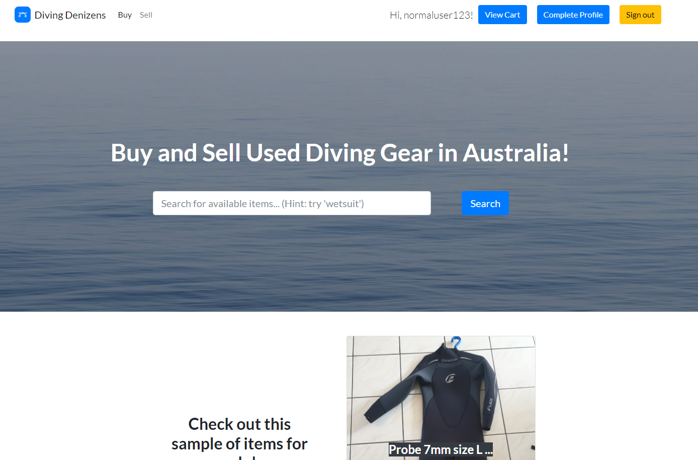
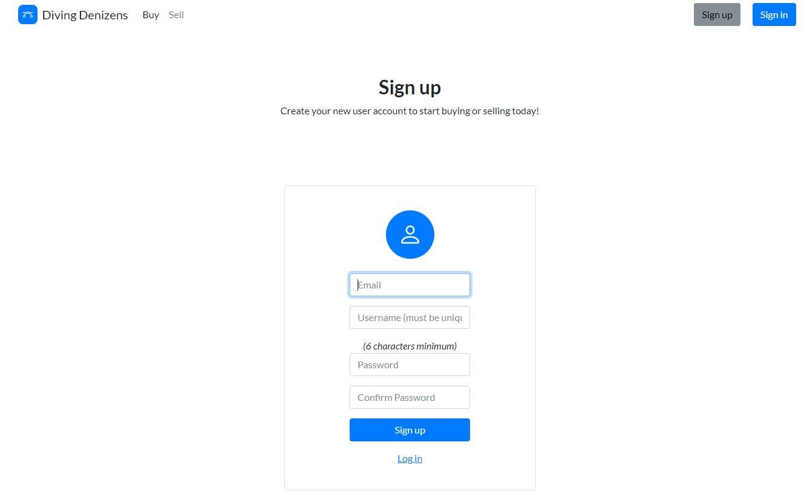
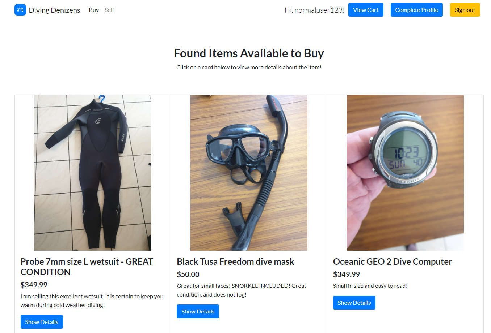
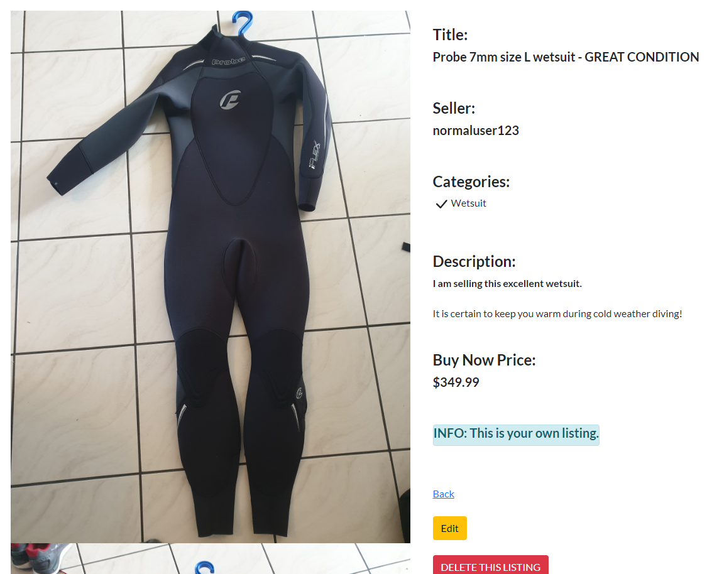
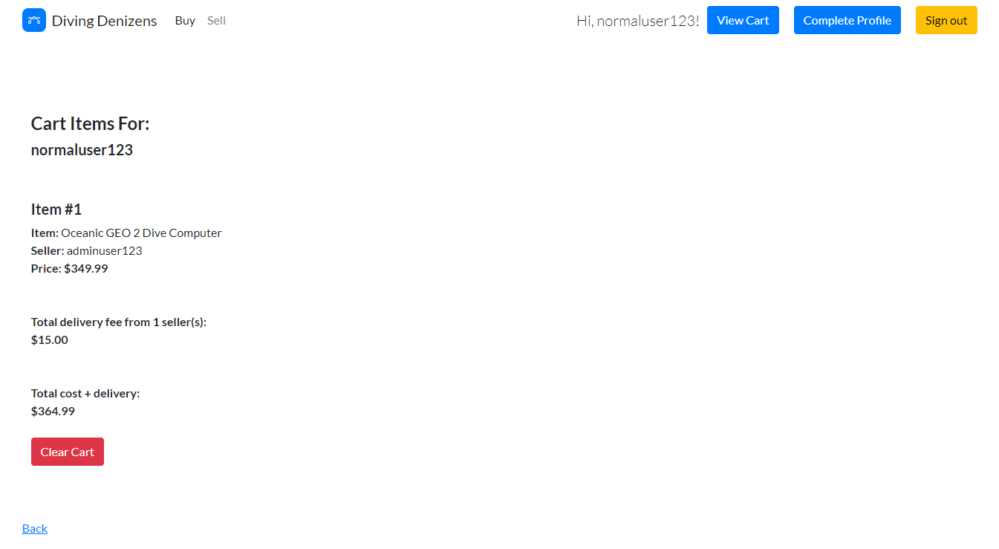
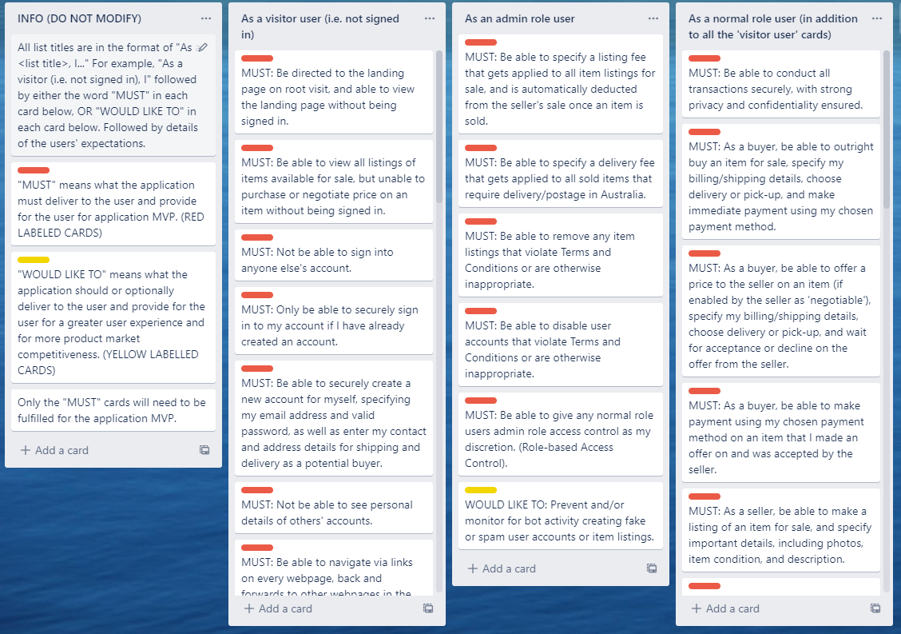
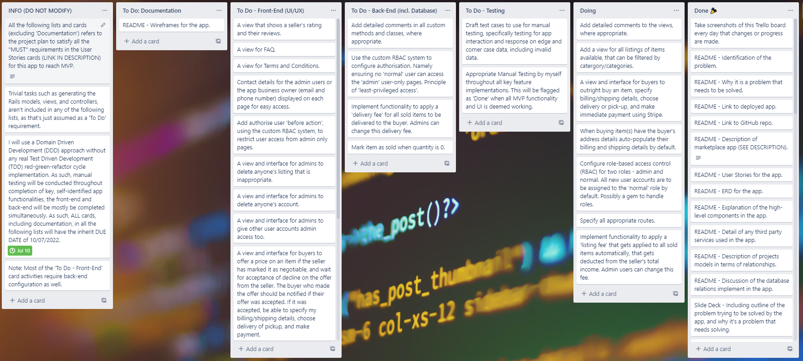
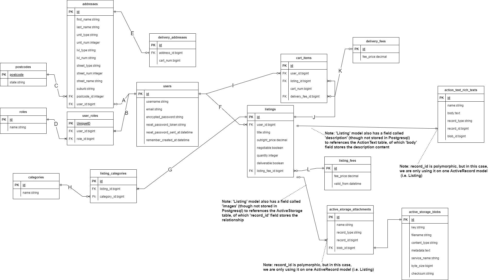

# Diving Denizens - T2A2 Marketplace Assessment
### - By Christopher (Chris) Hullman

## Identification of Problem to Solve

There is no dedicated two-sided marketplace app in existance as far as I'm aware that is catered towards buying and selling used dive gear in Australia.

## Why is it a Problem that Needs Solving?

Buying and selling used dive gear can be challenging, as although it is targeted towards a relatively small consumer market, there is such as arguably massive amount of different categories and sub-categories of dive equipement types (e.g. "wetsuit", "fins", "camera", "camera housing", etc.). This makes filtering and searching for specific dive gear to buy quite challenging in the used market. To elaborate, the most common means I've noticed of selling used gear is either via social media (e.g. Facebook), or a general marketplace site (e.g. Gumtree), but these sites aren't tailored with divers in mind who want to search for specific dive gear!

Furthermore, I've noticed anecdotally that many divers tend to sell their equipment in 'bundles' or as gear packages in the single 'listing. This presents a problem if a buyer only wants one item of gear from the bundle, and then the seller is forced to delete his original listing of a gear bundle, and re-list it again with the now missing one item that was bought. I want to encourage the seller to sell gear in seperate listings, and so then the seller can choose to apply a discount if the buyer chooses to purchases multiple items from the one seller in the one order and transaction.

## Deployed App Links

### Production:
**[https://divingdenizens.herokuapp.com/](https://divingdenizens.herokuapp.com/)**

### Staging (use with caution):
**[https://staging-divingdenizens.herokuapp.com/](https://staging-divingdenizens.herokuapp.com/)**

## How to Use (Deployed Apps)

1. Browse to the 'production' deployed app link above. The deployed app has already been seeded with 2 registered user accounts and 3 item listings, amongst other seeds, by default.
2. If you are **not signed in:**
    - Click **Sign In** on the top-right nav bar
    - Enter in for email, either: **test@test.com** (for a 'normal' user) OR **admin@test.com** (for an 'admin' user)
    - Enter in for password: **abc123** (lowercase)
3. If you've signed in as the 'normal' user, it has the username **normaluser123**, and owns 2 listings (the 'wetsuit' and the 'mask/snorkel').
4. OR, if you've signed in as the 'admin' user, it has the username **adminuser123**, and owns 1 listing1 (the 'dive computer').

Please note that as of writing, there is no 'admin' only functionality yet implemented into the app's logic, only in the database.

## GitHub Source Respository Link

**[https://github.com/chullman/diving-denizens](https://github.com/chullman/diving-denizens)**

## How to Use (From GitHub repo)

1. **System requirements** (this was built, tested and managed on an Ubuntu 20.04 environment):
    - Rails 6.1.6
    - Ruby 2.7.5
    - Node 16.15.0
    - Postgresql 12.10
2. Start the postgresql server locally with the command: **sudo service postgresql start** (enter your sudo password).
3. Clone the above GitHub repo to your local machine.
4. In terminal, CD into the root directory of your cloned repo.
5. Run the command: **bundle** (to install Gems).
6. Run the command: **yarn** (to install Node dependencies).
7. OPTIONAL, run the command: **rails webpacker:install** (should not need to override any files when prompted).
8. OPTIONAL, run the command: **rails webpacker:compile**
9. Run the command: **rails db:create**
10. Run the command: **rails db:migrate**
11. OPTIONAL, run the command: **rails db:seed**
12. Proceed with the steps in the **How to Use (Deployed Apps)** section above if you ran Step 11.

## Description of App

### Purpose

To provide a holistic, single platform as a two-sided marketplace app to solve the aforementioned problems at the top of this README around buying and selling used dive gear in Australia

### Functionality/Features for MVP

- Built on Ruby on Rails and Postgresql.
- (Devise gem) Secure user registration system with sign up and sign in, with the ability for the user to specify their username.
- Authorisation in place on what users can see or edit.
- Highly responsive website with thanks to the implementation of the Bootstrap framework.
- Trix editor implementation and rendering for rich text creation when a seller creates a listing.
- Ability to upload multiple images per listing, with thanks to ActiveStorage.
- Amazon AWS S3 Bucket configured and deployed for image persistence on the Production deployed environments.
- Heroku deployment for Production deployed environments.
- Ability for the user to 'complete their profile' by entering in their address information, with the intention that this will become the default 'shipping' address for buyers when placing an order.
- Ability to search for an address: This calls an external, third-part API that intelligently parses the address search query and if an address is found, pre-populates the address field for the user.
- Ability for sellers, when creating a listing, to specify one or more different categories of items for their listing.
- Ability for a buyer to 'search' for listings via the landing page, which searches for listings either via the listing title name or by the listing's categories.
- For 'role-based access control', all new users are automatically assigned the 'normal' role, by default.
- Database is *mostly* normalised to 3NF.

### Limitations and Bugs from MVP

**Unfortunately**, *I ran out of time, as of writing this, to complete my app to MVP. Please refer to the Trello **Implementation Plan** cards that are missing from the **Done** list in Trello.*

Specifically:
- All new listings are defaulted to have a quantity of 1, are not negotiatable (so the buyer is unable to place a price 'offer' on the listing), and it assumed to be deliverable by default (i.e. no pick-up) so a delivery fee gets applied automatically to a user's shopping cart.
- No model/table or functionality in place for buyers to leave reviews for the seller.
- Unable to clear individual items from shopping cart.
- No ability to process order from the shopping cart, specify delivery address, or make payment via Stripe.
- Database tables and models are set up to allow for 'admin' role users, but currently users with the admin role.
- The one listing can be 'added to cart' by the same buyer, multiple times, even though quantity of each listing is only 1.
- A 'listing fee' (so the app owner can make money) is specified and configured in the database, but no implementation yet to automatically apply it to all successful sales.
- Very minimal code comments and messy code.

### App Screenshots

### Target Audience

Users: Any buyers and/or sellers within Australia looking to buy and/or sell diving equipment (e.g. scuba, freediving, snorkelling).
Administrators: To be able to manage users and listings within the app, where needed, and to change pricing information, where needed.

### Tech Stack

App and database configuration tools:
- Rails 6.1.6
- Ruby 2.7.5
- Node 16.15.0
- Postgresql 12.10
- (and various gems and node packages)
- HTML 5
- CSS 3

Deployment platform:
- Development: Local disk
- Production: Heroku and Amazon AWS S3

## User Stories

**[https://trello.com/b/KAQ2BD78/diving-denizens-user-stories](https://trello.com/b/KAQ2BD78/diving-denizens-user-stories)**

## Implementation Plan

**[https://trello.com/b/dduTSMRl/diving-denizens-mvp-implementation-plan](https://trello.com/b/dduTSMRl/diving-denizens-mvp-implementation-plan)**

## ERD

## ERD Discussion

**Models and Relationships (refer to relationship letters in ERD diagram above):**
- User: All new user accounts are registered into this model with thanks to devise, and when a user signs in, it is checked against this model.
- Role: Ensures integrity by only holding two records that will be checked against to specify role-based access control, that is, "normal" and "admin".
- UserRole: Join table as many users can be both a "normal" and "admin" user, and many roles can belong to many users (Relationships B and D).
- Address: When the user 'completes' their profile, they can populate their address details which will be used as their default shipping address (Relationship A). This same model is also used to hold new addresses when the user makes an order and specifies their shipping address.
- DeliveryAddress: As explained above, holds an order address for shipping details against a user's order (that is, all items in their cart) (Relationship E).
- Postcode: Added for 3NF as 'state' is a transient dependency on 'postcode' (Relationship C).
- Listing: All information directly related to an individual listing is here, tied with ActionText and ActiveStorage (Relationship F keeps track of the seller, relationship L keeps track of the listing fee at that time for the listing).
- Category: Again for integrity, and so there's no mismatch of listing categories, this model will hold the one-truth of listing categories (e.g. "wetsuit", "mask", etc.)
- ListingCategory: Join table as many listings can have many categories, and many categories belong to many listings (Relationships G and H).
- CartItem: Holds the storage of all user's shopping cart items (Relationship J and I). The field "cart_num" keeps track of all the items that belongs to the one user's cart.
- DeliveryFee: Holds the current delivery fee. It is the intention that when the admin interface is implemented, admin users can change this fee value that gets applied to all orders (Relationship K).
- ListingFee: Keeps a record of the listing fee at a particular point in time, that way if a seller creates a listing, and the listing fee happens to change afterwards, the seller's original listing fee won't get changed so that they're not scammed.

## High-level components

The app is entirely based on an MVC model:
- Model: Likened to a Object-Relation Mapper (ORM) that provides the interface between the database and the controller, and allows for certain query customisations to be performed against the model itself. All models inherit from ApplicationRecord.
- Controllers: The 'brains' of the application for which all routes go through where I can filter, select, manage and strip data from the model that is needed for the view, or to be passed back into the model for writing into the database. All controllers inherit from ApplicationController.
- Views: Provide the display and the UI/UX functionality for end-user interaction with the app. Takes instance variables from the controllers and/or the view passes back information into the controller by means of routes and HTTP verbs (CRUD operations). The 'layouts/application.html.erb' file provides the entry point for which all other views are injected into.

## Third-party Services:

**Gems:**
- activestorage-validator
- aws-sdk-s3
- devise

**APIs and Platforms:**
- AWS S3 bucket for image hosting on production environment
- Heroku for production deployment
- Geoscape (API for Australian address lookup and parsing)

